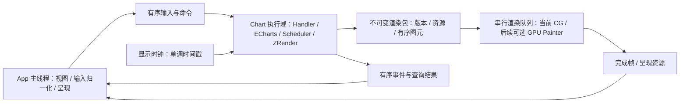

# Native 对标 ECharts Web 的性能优化技术方案

状态：待实施的技术方案。日期：2026-09-06。目标平台：macOS 12+、iOS 15+；分别在真实设备上验收。

**目标是在相同数据、图表功能、视觉质量和输入轨迹下，使 Native 的计算、呈现延迟和持续交互性能达到固定版本 Web 的水平。** 后台执行、降低数据量、减少回调、只完成首个 progressive chunk，都不能单独视为达标。

当前主线是优化现有 Swift EChartsKit / ZRenderKit 主体逻辑，以及 ApplePainterSupport / CALayerPainter 的 Core Graphics 绘制。两部分分别测量、独立实施，共同以 Web 为性能对照。Core Graphics 是当前实际交付后端。

GPU 留作后续独立 Painter 工作：可以新增 Painter，也可以在 RasterizerPainter 基础上继续优化，不作为本轮工作的前置条件。主体逻辑保持后端无关，通用几何和资源处理在已有共享边界复用，CG 专有缓存与栅格化策略留在 CG 后端。后续换 Painter 可以继承主体逻辑收益；CG 专有优化也继续服务 CG 用户，无须随 GPU 引入而撤销。

## 1. 基线、范围与证据等级

本方案依据当前工作区，包含尚未提交的 Painter / Examples 拆分。ECharts 固定为 `20ecdf4cae568f31d350a1c547516d08cdcab9b0`，ZRender 固定为 `349111033fba0fa08cee745b72dd2ea66dc6fcaa`，版本均为 6.1.0；RasterizerPainter 独立仓库当前提交为 `bf470d27f34c8463b0817010b8fd801a55c8a26a`。

已有探针在 640 × 420、DPR 2 下，通过真实 Handler 注入固定锚点的五次滚轮，保留同一 chart。每种组合两轮；下表是两轮各自的中位数范围。

| 用例 | Native Release：事件处理 + flush | Web：事件处理 + flush | Native 主要阶段 |
|---|---:|---:|---|
| 4 万点散点 | 53–54 ms | 9–27 ms | 事件 43–45 ms，Painter 9–10 ms |
| 50 万柱 | 870–874 ms | 172–275 ms | 事件 399–408 ms，Painter 466–471 ms |
| K 线 + 四条均线 | 约 39 ms | 9–25 ms | 事件约 33 ms，Painter 约 5 ms |

两端每一步的系列数据条数、用户 inside/slider 窗口一致。大柱图 Release 首屏 setOption + 首次 flush 约 2.8 s，Web 376–389 ms。数据不变的重复 refresh，大柱图 Native 仍约 380–394 ms，Web 可跳过未变层。

这些是**已测量的同步调用耗时**，不是 GPU 完成、真实呈现时间或 FPS。第一轮部分运行与编译/其他探针重叠，第二轮已串行复测；Web 波动较大。8 秒 CPU 采样来自 Debug 大柱图，只用于定位调用链，不能据此声称 Release 的精确热点占比。当前尚无完整性能验收结果。

原始记录和探针在 [本次分析目录](../build/performance-analysis-20260906/analysis.md)；该目录为本地生成证据，不进入提交。上表作为本方案的可持久阅读摘要，实施时必须重新建立基线。

## 2. 与 ECharts / ZRender 实现的差距

| 层次 | 固定上游实现 | 当前 Native 实现 | 优化方向 |
|---|---|---|---|
| 任务图 | Scheduler 连接 data、processor、visual、render task | `prepareView` 未连接 render task，主渲染直接调用 view.render | 完整接通任务图及 dirty / outputData 传播 |
| progressive | `_onframe` 在帧预算内推进 unfinished tasks | layout/visual 的部分 executor 同步跑完整数据区间 | 恢复上游分块、帧续跑、最终 finished 语义 |
| 大数据绘制 | large 合并图形，progressive 分批绘制 | large 已实现；部分 incremental 方法尚未通过主链执行 | 分别验证 large 与 incremental，不能根据方法存在判断已支持 |
| 数据存储 | 数值列使用对应 typed array，保留特殊数据类型 | DataStore 的 ParsedValue 为 Any，数值热循环经过动态读取 | 数值列专用存储及批量访问，边界保留动态兼容 |
| 坐标计算 | 相同的轴映射、归一化、clamp / onBand 算法 | Swift 值类型映射带来重复小数组构造和 COW | 优化类型映射与分配，保持公式和计算顺序 |
| 最近点查询 | 当前上游 `Series.indicesOfNearest` 本身也是 O(N) 扫描 | 同样扫描，但每条数据的动态值和坐标转换成本更高 | 先降低扫描常数，不虚构上游具有二分/空间索引 |
| 图层与 dirty | 未变层跳过；可选脏矩形；独立 hover / incremental 路径 | 普通刷新整帧重画；IncrementalDisplayable 有专用保留位图 | 从普通层复用开始，补齐 hover / dirty-region 生命周期 |
| 输入 | 归一化 wheel，RoamController、inside range、throttle 协同 | 已有 range 累积和 20/100 ms 节流；部分行为由 EChartsView 手工桥接 | 对齐控制器和事件顺序，保持每次输入的语义 |

源码入口：

- [ECharts.swift](../Sources/EChartsKit/core/ECharts.swift)：`update`、`runSeriesStageHandler`、`renderSeries`、`appendData`。
- [Scheduler.swift](../Sources/EChartsKit/core/Scheduler.swift)：`prepareView`、`performVisualTasks`、`getPerformArgs`。
- [Chart.swift](../Sources/EChartsKit/view/Chart.swift)：render task、incremental 方法分派。
- [DataStore.swift](../Sources/EChartsKit/data/DataStore.swift)、[Series.swift](../Sources/EChartsKit/model/Series.swift)、[Axis.swift](../Sources/EChartsKit/coord/Axis.swift)。
- 上游 [echarts.ts](../upstream/echarts/src/core/echarts.ts)、[Scheduler.ts](../upstream/echarts/src/core/Scheduler.ts)、[Painter.ts](../upstream/zrender/src/canvas/Painter.ts)、[Layer.ts](../upstream/zrender/src/canvas/Layer.ts)。

**重要边界：** 当前大散点和大柱图两端都配置 `progressive: 0`。补齐 progressive 不会自动消除这组同步用例的差距，数据热路径和 Painter 吞吐必须分别改善。

## 3. WebKit 与 Native 平台架构的差距

WebKit 将页面放在独立 WebContent 进程，使页面计算与宿主 UI 隔离；普通 ECharts 数据处理和布局仍在页面 JS 主线程上。不能将 Web 性能归结为 ECharts 自动多线程计算。[WebKit 官方架构](https://docs.webkit.org/Deep%20Dive/Architecture/WebKit2.html)

| 方面 | 当前 Native | 目标设计 |
|---|---|---|
| UI 与图表执行 | App 主线程同时执行输入、模型、布局、动画和 CG 绘制 | 先隔离绘制；完整计算隔离在 API 契约明确后加入 |
| 帧时钟 | macOS 主 RunLoop 60 Hz Timer；iOS 主 RunLoop CADisplayLink | 与显示器同步的 host clock，所有动画使用同一单调时间 |
| 像素生成 | 主线程 CGContext 栅格化、makeImage、CALayer.contents | 当前优化 CG 栅格化、缓存和离屏发布；后续可替换 GPU Painter |
| 资源与命令 | Swift 场景对象直接传 Painter | 不可变渲染数据包，几何/文本/图像资源持久复用 |
| 流量控制 | 重计算阻塞输入；缺少完整的帧背压边界 | 有界待呈现帧、GPU in-flight 限制、失效帧不覆盖新帧 |

WebKit 图形处理的线程/进程分工因系统版本和后端而异，实际 Canvas 加速情况需 trace 确认。`Canvas.refresh` 返回不是 GPU 完成，Native `CALayer.contents` 赋值也不是已经上屏。双方最终比较必须采用相同的可见输出口径。

现有 Metal 后端还存在两项明确边界：

- [RasterizerPainter.addPath / emitBoostRects](../RasterizerPainter/Sources/RasterizerPainter/RasterizerPainter.swift) 对 large primitive 仍逐个 CG fill、生成位图并翻转，再作为纹理提交。仅切换 renderer 不能解决大数据 CPU fill。
- [RasterizerLayer.mm](../RasterizerPainter/third_party/Rasterizer/Sources/RasterizerObjC/RasterizerLayer.mm) 的实时路径已有两个 in-flight buffer，忙时不阻塞等待；`displayAndWait` / `waitUntilCompleted` 属于同步捕获路径。不能把测试同步等待误判为实时管线的默认行为。

Rasterizer 还存在阴影、复杂裁剪、部分 blend/join 和 motion-blur 语义缺口，见其 [README](../RasterizerPainter/README.md)。性能后端必须与这些能力一起验收。

## 4. 目标架构与兼容边界

### 4.1 先保持同步语义，再隔离计算

第一阶段继续由主线程拥有 ECharts/ZRender 的可变状态，完成热路径、分帧和现有 CG Painter 内部优化，保留当前 Painter 接口。随后在确实需要隔离绘制时冻结渲染数据，在独立串行队列执行 CG 离屏绘图，主线程发布结果。这样保留现有 `setOption`、`dispatchAction`、查询和同步回调语义。不可变渲染包不作为数值热路径或 CG 缓存优化的启动条件。

第二阶段提供显式的后台执行宿主：一个 chart 的模型、Storage、Handler、Scheduler、动画和计时器由同一个串行执行域拥有。不同执行域之间只交换输入值、不可变资源和完成帧。执行域是所有权保证，不要求初期为每个 chart 创建一个永久 OS 线程。

图中展示引入执行隔离后的边界；EC 在第一阶段仍位于主线程，第二阶段才能移出。layer/view 生命周期和平台要求的主线程操作必须分开审计，不能把整个 CALayerPainter 实例任意扔到后台。后续 GPU Painter 可以复用经过验证的冻结数据边界，不要求现在实现 GPU 专有命令系统。

### 4.2 冻结渲染数据，不跨线程共享 Displayable

新增宿主/后端层的不可变渲染包，建议包含以下概念字段；名称为方案示意，实施前先检索现有 seam。

| 字段 | 用途 |
|---|---|
| chartGeneration、stateRevision、frameSequence | dispose/resize/重建失效，防止旧帧覆盖新帧 |
| inputSequence、logicalTimestamp | 关联输入、动画时间和呈现延迟 |
| viewport、DPR、颜色空间、背景 | 冻结本帧设备条件 |
| resourceId + revision | 引用几何、图像、字形和 clip 资源，避免每帧深复制 |
| 有序 draw commands | path、rect batch、symbol batch、text、image、clip、opacity、blend、z 顺序 |
| dirty / previous paint bounds | 层复用和脏区域重绘 |
| completion / release token | GPU 完成前资源不可复写，完成后回收 |

`[Displayable]` 是可变 Swift 对象图，不能通过 `@unchecked Sendable` 绕开所有权。跨队列 packet 大小、构建成本和资源复制量必须纳入 benchmark；不要为了搬线程每帧复制几十万图形。

### 4.3 API、回调与多 chart

- 现有同步 chart API 和回调线程保持原契约；后台宿主使用显式异步命令/查询接口，不能让原 `getOption()` 静默返回旧快照。
- 需要同步返回值的 formatter、symbolSize、renderItem 等，必须在 chart 执行域同步完成。后台模式只接受满足该执行域要求的回调；依赖 AppKit/UIKit 的回调继续使用同步宿主，不能后台调用或主队列同步互等。
- `dispatchAction` 回调内 `setOption` 的重入、事件排序、异常与 disposed 检查保持上游行为；跨域通知不是可随意丢弃的状态快照。
- 注册表、platformApi、文本/图像缓存、跨 chart connect/事件和全局内部存储逐项审计。注册在启动阶段完成；可变缓存采用执行域所有权或明确同步。初期只允许一个后台 chart 执行域，解除全局共享风险后才启用多 chart 并发。
- Core Text 布局对象留在单次操作或所属队列，跨队列传不可变结果；AppKit/UIKit 对象不随意共享。[Apple Core Text 线程约束](https://developer.apple.com/documentation/CoreText)

后台宿主的吞吐和正确性通过后才能列为发布能力。默认同步模式如果仍不达标，也必须报告失败，不能以后台模式结果覆盖它。

## 5. 工作包 A：数据和交互热路径

### A1. 按列类型消除热循环 Any 成本

以 DataStore 为边界保存 float/int/ordinal 等类型，数值列使用 [PORTING](../PORTING.md) 规定的 ContiguousArray 类型。动态 option、混合值、原始行和公开访问接口保留兼容。

在批量操作开始时判断列类型，内部循环直接访问数值缓冲；不要每一项做桥接、Any cast 或构造临时数组。检查 `selectRange`、extent、stack、visual、barGrid、points layout、SourceManager 和 cloneShallow 的数据所有权；过滤优先使用上游的 raw storage + index view，避免复制整张数据表。

必须覆盖 NaN、缺失值、字符串类别、整数转换、空数据、重复类别、rawIndex、appendData、stack 和 clone 后写入隔离。Double 计算及上游 typed-array 精度约定保持不变，不全局改成 Float 换性能。

### A2. 坐标转换与模型读取

针对已采样的 `makeExtentWithBands`、Axis.dataToCoord、Cartesian2D.dataToPoint，先优化小数组分配、桥接、可专门化的调用与不必要的重复解析。遵守现有 value-return 数学接口，不能恢复存在别名危险的 inout 参数。

若要在同一布局任务中缓存 adjusted extent / scale 参数，缓存必须具有数据窗口、axis extent、onBand、inverse、log、resize 的完整失效条件。先证明与原公式等价；保持浮点计算次序，不能用改变精度或坐标范围的方式掩盖性能。

不直接把 Series.indicesOfNearest 替换成二分查找：上游也是线性扫描，数据可能无序、重复、过滤或经过非线性轴。第一轮优化仍保留扫描与 tie-break。确需索引时另立设计、证明查询语义与失效机制，并明确其属于上游之外的算法扩展，不能混入忠实移植补丁。

### A3. 输入与更新合并

统一 AppKit/iOS 输入到 ZRender wheel/pointer 的单位和方向；记录 precise scrolling、阶段、惯性、modifier 和坐标/DPR。与固定 Web 的 RoamController / insideZoom 逐项对照，不用肉眼猜滚轮缩放因子。

保留 upstream throttle 的范围累积和事件顺序。允许合并待绘制帧，允许上游本来会合并的 pending action；**不能简单累加原始 delta 或只保留最后一个 wheel 事件**，因为非线性因子、变化的锚点、modifier 及外部监听可能改变结果。click/down/up、legend、brush、公开回调和命令不丢弃。

axisPointer 与 tooltip 的 expensive work 按上游 dirty/事件规则处理，不能通过关掉 tooltip 或省略 downplay 获得成绩。连续输入下同时验收指针响应、最终窗口和中间动画连续性。

## 6. 工作包 B：恢复完整 Scheduler / progressive

按上游最小完整单元依次接通：

1. `Scheduler.prepareView` 将 renderTask 连接到 pipeline，填充 model/ecModel/api context，正确表达 incremental 能力。
2. 修复 overall processor stub 的 outputData 传递、dirty 传播与 reset/progress 顺序，然后把现有 direct visual/layout 分派迁回任务链。
3. `renderSeries` 使用 `renderTask.perform(getPerformArgs(...))`，保留 clearStates、selection、layoutlabels、transition、z 更新顺序。
4. 将 ECharts `_onframe` 绑定到同一 ZRender animation frame，按固定上游预算推进 unfinished tasks；不是把同一循环拆成多个 DispatchQueue.async。
5. 接通 `appendData` 的剩余任务推进，去掉已验证场景的同步全更新兜底；数据处理器仍同步的上游阶段需计入首帧成本，不能假设所有阶段都能分块。
6. 完整验证 Bar、Scatter、Candlestick、Heatmap、Lines 的 incrementalPrepareRender/incrementalRender。尤其核对 barGrid chunk-local/global index、modBy/modDataCount、large/normal 阈值切换和 `preventIncremental`。
7. 新 action、resize、setOption、dispose 使旧生成任务和帧正确失效；遵循 upstream finished/rendered 事件条件，不能未完成全部数据就发 finished。

初期使用固定上游 chunk/预算，不擅自引入自适应策略改变动画进程。任务单位仍超过帧预算时先记录是哪一阶段，再在保留其语义的前提下设计更细的执行边界。

现有 CALayerPainter type 为 canvas，而 RasterizerPainter type 为 rasterizer；Scheduler 当前按 canvas 判断 progressive。需要在 renderer extension/seam 明确能力和 Canvas-compatible 契约。只有完整支持 incremental/hover/layer 生命周期的后端才能进入该路径，不能只改 type 字符串冒充支持。

## 7. 工作包 C：当前 Core Graphics 绘制优化

### C1. 普通层复用与版本化资源

先实现持久 framebuffer / layer dirty 状态、前一帧显示列表和正确失效，使完全未变场景不再重建 CGContext。CGPath、文字排版/字形、图像解码及 clip geometry 以内容/资源版本缓存，设置内存上限。

缓存不依赖每帧对大数组做全量 hash 或 equality；在共享场景逻辑产生变更时维护几何/style/transform revision，再由后端消费。必须覆盖 setShape、动画、clip、渐变边界和 strokePercent。没有验证的调用路径使用保守失效，不能复用旧图形。

按上游 Layer/Painter 实现 paint rect 合并、旧位置清除和重绘。脏矩形内重画所有相交元素，保持 z-order、透明度、裁剪、阴影和 blend；不能只重画带 dirty 标记的元素。首帧、resize、复杂合成、motion blur 和不兼容 incremental 组合回退完整层。

hover/axisPointer 能单独更新时复用底图；在跨层 blend/clip 有依赖时必须保持合成语义。全窗口 dataZoom 通常使数据层整体变脏，dirty-rect 不能作为其主要加速手段。

### C2. CG 大数据绘制热路径

围绕 LargeBarPath / LargeSymbolPath → packed rects → CGRenderer.fillBoostRects 分别计时：几何准备、临时缓冲分配、裁剪处理、逐图元填充、makeImage 与 layer 发布。测量未变帧、几何变化帧和只有样式/transform 变化的帧，避免只优化静态缓存。

优先减少已确认的中间数组构造、重复几何转换及可复用的上下文/资源分配；缓存与失效绑定到实际 shape/style/clip 版本。批量数据尽量在已有 renderer seam 直接访问，避免大缓冲反复桥接或复制。共享类型改进让各 Painter 受益，CGContext/CGPath 专有处理保留在 Apple 后端。

逐项检查 CG fill 与其他候选绘法的吞吐、内存和透明合成语义。当前代码已有合并矩形/复合路径导致超线性扫描转换的历史说明，不能机械替换成 `fill([CGRect])`。任何替换均通过相同大数据和透明重叠场景验证，不改变数据量、亚像素柱宽或逐 datum alpha。

优化后对比 T_model、T_renderCPU 和端到端延迟。若 CG 栅格化仍超出 Web，对该用例明确报告剩余差距，作为后续 Painter 选型依据；主体逻辑与其他 CG 优化继续独立交付，不等待 GPU。

### 后续独立工作 G1：large GPU primitive stream

以下为后续 Painter 工作的技术参考，不属于当前实施主线或验收前置条件。可通过新增 Painter 或扩展 RasterizerPainter 落地，具体后端届时根据测量决定。

沿现有 Painter seam 增加可直接消费连续缓冲的 rect/symbol/candlestick 批量命令，替代当前 large → CPU bitmap → GPU texture 路径。最小实现从实心 large bar 和小散点开始，后续覆盖 OHLC 与 heatmap。

- GPU 以 instance/批量顶点缓冲绘制矩形、点和 OHLC 几何；不创建几十万个 Swift/ObjC 图形对象，不把每个 primitive 变成独立 draw call。
- 保留图元提交顺序、series/display-list 顺序、逐 datum source-over、预乘 alpha、颜色空间及 clip。不能把重叠透明图元合成一次 compound-path fill，也不能按颜色排序改变覆盖顺序。
- 正确覆盖亚像素宽柱、负宽高、NaN、裁剪边缘和 DPR；禁止整数吸附或丢弃小于 1 px 图元。AA 方案必须通过与 Web 的语义及覆盖率验证。
- instance buffers 按数据/布局版本更新；几何不变而只有 transform/style 变化时仅更新必要资源，避免全量上传和临时矩形复制。
- GPU 回读仅用于验证；生产渲染不经 CGImage/readback。通过 pipeline capture 检查 large 实际走了 GPU，不能只看 renderer 名称。
- 不支持的效果走正确回退，记录 fallback reason 和耗时。回退后的用例仍参与性能门禁；不能以“不支持”免除指标。

后续可在现有 Rasterizer 做此批量路径的垂直实现，比较吞吐、CPU 编码、GPU 时间和视觉；也可在同一 renderer seam 实现新的 Painter。无需重写 EChartsKit 或把图表语义搬进 shader。

### 后续独立工作 G2：GPU 资源与提交

复用现有 in-flight 机制，采用资源环和 completion 回收，不在实时主线程 `waitUntilCompleted`。缓冲数以延迟/吞吐实测决定，初始 2，必要时 3；多缓冲不是越多越好。CPU 不得复写 GPU 正在读取的资源。[Apple CPU/GPU 同步说明](https://developer.apple.com/documentation/metal/synchronizing-cpu-and-gpu-work)

待呈现 packet 队列上限初设 2，GPU in-flight 独立计数；有新帧时可以丢弃尚未提交的过期呈现包，但不能丢模型动作。每包必须能依赖已上传版本完整呈现，不能丢掉后续帧依赖的 incremental delta。需要时生成完整 checkpoint 或保留资源依赖。

`nextDrawable` 等待、资源分配、上传、CPU packet 构建、RA scene 转换都单独计时。GPU 已快但主线程/桥接仍慢时，不能把 GPU 时间当总成绩。

## 8. 工作包 D：显示时钟与执行隔离

macOS 14+ 使用与 view/display 关联的 display link；macOS 12/13 保持部署支持，使用可用的 CVDisplayLink 等适配，回调只发送时间信号，不直接读写 UI 或场景。iOS 使用 CADisplayLink，并响应实际刷新率变化、窗口迁移、后台/恢复。[Apple macOS 14 Display Link](https://developer.apple.com/documentation/macos-release-notes/appkit-release-notes-for-macos-14?language=objc)

所有动画 clip、ECharts `_onframe` 和 ZRender flush 使用同一逻辑时间戳；同一显示周期只推进一次，不能一个 timer 更新模型、另一个 timer 更新 Painter。积压时不循环补画每个过期视觉帧，但任务完成和公开事件语义不能被跳过。

先落地 4.1 的“主线程计算 + 独立渲染”边界，再视主线程 trace 推进“后台 chart 执行域”。`throttle` 当前硬编码 DispatchQueue.main，需平台计时 seam 绑定到 chart 所属执行域；同步宿主仍保持原主线程行为。计时器、图片加载完成和 demo drive 回调都要纳入所有权审计。

后台执行能改善宿主响应，不能单独降低 O(N) 工作量。即使 UI 主线程已经流畅，若输入到图表真正更新仍落后 Web，该场景继续判失败。

## 9. 对标和验收协议

### 9.1 两组负载必须分别通过

| 负载组 | 配置 | 目的 |
|---|---|---|
| A：严格同配置 | 当前相同 option、相同数据和输入；保留大柱图/大散点 progressive:0 | 验证纯数据和绘制吞吐，不以分帧配置差异掩盖回归 |
| B：上游实际大数据能力 | 两端同时恢复固定上游的数据规模、输入表示和 progressive 配置 | 验证官方规模和持续交互，不停留在已缩小的 Native demo |

最低场景矩阵：

| 用例族 | 数据与变化 | 输入/状态 |
|---|---|---|
| large scatter | 当前 4 万；上游 100 万总点数；另设 10 万梯度 | 轮入/轮出、锚点移动、tooltip、slider、restore |
| large bar | 50 万；10 万/100 万压力档 | 全范围缩放、窄窗口、反向、axisPointer、toolbox |
| candlestick + volume | 当前 large 2 万；上游 20 万；SH-2015 + MA | 双 grid 联动、快速滚轮、动画中间帧、最终恢复 |
| heatmap | 当前 20,301 cells、continuous/piecewise visualMap | progressive、visualMap 拖动、hover 清理 |
| lines / appendData | 固定 NY 资产 manifest 全部 chunk | 首批、中途追加、全部完成、销毁后回调 |
| 普通图形与组合 | 小 bar/line/scatter、标签密集、透明重叠、复杂 clip | 保证大数据优化不损害小图、文本或效果 |

数据规模来源先验证 Native/Web/官方源和生成 manifest，不能只相信旧注释。固定 seed、数据 hash、series 数量、raw/filtered count、typed-array 表示、字体、locale、时区、颜色空间、viewport 和 DPR。测试 harness 的统计表移出计时段；实际用例本身需要的数据生成和解析分别计时并纳入端到端加载报告。

每个用例执行首屏、稳定绘制、150 ms 间隔轮事件、原有五次同步 rapid-wheel、60/120 Hz 连续 5 秒输入、反向和锚点改变、停止后恢复。对上游支持的行为生成真实 Handler 场景，unsupported 不能被静默当 pass。

### 9.2 测量口径

每条输入带 sequence 和单调时钟；输出关联对应的 model revision 与 frameSequence，区分以下时间：

| 指标 | 定义 |
|---|---|
| T_model | 数据处理、layout、visual、动画更新的 CPU 工作，不含排队 |
| T_renderCPU | packet 构建、几何/文本、CG raster 或 Metal 编码/上传 |
| T_submit / T_GPU | 命令提交与 GPU 执行，分别记录，不代替呈现 |
| T_firstVisible | 输入产生到首次出现包含该输入有效结果的屏幕帧 |
| T_finalVisible | 最后一次输入到相应完整数据/最终动画状态真正呈现 |
| Frame interval / hitch | 持续更新期间实际可见帧间隔和长帧比例 |
| Main-thread blocking | chart 在宿主 UI 主线程的 CPU 区间与 RunLoop 延迟 |
| CPU / memory | 宿主及相关 WebContent/GPU 进程的可归属增量；峰值与稳定值 |
| Throughput | 同等完整数据量完成所需时间，防止只画首批虚报速度 |

Native 使用 signpost + Time Profiler / Allocations / Metal trace；Web 用页面内 performance 标记与 Web Inspector/系统 trace。OS 输入、跨进程时钟用同步握手校准，报告不确定度。rAF 回调、commandBuffer completed、Core Animation transaction completion 都不能直接标为“已显示”。

使用可见内容标识与系统呈现 trace；需要时做相同条件下的高帧率录制/外部拍摄，将 frameSequence 与图表实际窗口变化关联。标识不能独立于图表内容提前刷新。GPU readback 和确定性截图用于正确性验证，与性能运行分开。

Native Core Graphics、Native GPU、Web 每次单独可见运行，不并排竞争。Release -O/WMO、关闭 debugger；macOS 与 iOS 分别在同一台对应设备、相同刷新率/DPR下配对。记录 OS/WebKit/Xcode、硬件、编译标志、热状态和后端配置。

初始协议：2 次预热、至少 10 轮独立交互序列，每轮数百个输入；冷启动至少 10 个独立进程。交替/随机顺序运行后端，按序列汇总并保留分布，不能将同一序列所有相关事件当独立样本制造虚假置信度。两轮结果波动明显时继续定位环境，不挑最快一轮。

### 9.3 发布门禁：目标，不是当前成绩

“对标”的中心目标是 Native 不慢于 Web。考虑实验噪声，初始工程门禁规定以下容差；实施前冻结，不在失败后放宽。

| 项目 | 通过条件 |
|---|---|
| 配对场景延迟 | T_model+T_renderCPU、T_firstVisible、T_finalVisible 各自：P50 ≤ 1.10 × Web P50 + 1 ms；P95 ≤ 1.20 × Web P95 + 2 ms |
| 首屏/完整吞吐 | 同配置首个有效帧、完整完成时间分别满足相同相对门禁；progressive 首帧和最后一批都报告 |
| 60 Hz 交互目标 | 在 Web 可达到该档的场景：≥95% 的有效连续更新帧间隔 ≤1.1 × 16.67 ms，超过 2 帧预算的比例 <1%，并且不劣于 Web 对照的容差 |
| 输入反应 | 主流交互 T_firstVisible P95 ≤ max(50 ms, 用例原有 throttle + 两帧预算)，同时通过相对门禁 |
| 宿主响应 | 主线程 chart 自有单次工作 P95 ≤4 ms，压力测试无可归因于 chart 的 >50 ms 阻塞；后台等待不转移成不可见输入积压 |
| 资源 | 峰值可归属内存目标 ≤1.20 × Web 对照；重复加载/销毁 100 次后不得持续增长；有界帧队列和缓存；CPU 总消耗同时报告 |
| 正确性 | 窗口、data/raw index、事件、回调、选中、高亮、clip、动画与恢复均通过；无缺图、missingTarget、未解释 coverageNotes |

P95 是跨完整测试序列汇总的指标，须报告样本量和区间。若 Web 指标小于可测精度，先提高测量精度，不能直接用零作比例。每个必测用例单独过门禁，平均值/几何平均只能展示趋势，不能抵消某个慢场景。

严格同配置的 50 万柱图如果 Web 本身不能 60 FPS，要求 Native 达到其实际吞吐，并在 B 组 progressive 场景另验交互流畅。不能承诺“任何 100 万点配置均 60 FPS”。120 Hz 为独立追加验收档，使用 8.33 ms 帧预算，不用 60 Hz 的门槛冒充支持。

当前以 Core Graphics 后端验收：主体逻辑的阶段改善、CG 绘制改善和整图是否达到 Web 分开报告。阶段优化可以独立完成，但某个必测用例未过端到端门禁时，不能宣称该用例已经对标 Web。后续新增或增强 GPU Painter 后使用同一协议单独验收；其结果不能覆盖 CG 的未达标项，CG 的优化也不以 GPU 完成为条件。

## 10. 实施顺序、交付物与退出条件

| 阶段 | 具体交付 | 前置条件 | 完成判据 |
|---|---|---|---|
| P0 基线设施 | 持久 benchmark runner、数据/输入 manifest、阶段 trace、呈现测量、HTML/JSON 报告 | 当前源码快照 | 能重现现有差距，报告不混用 CPU/GPU/显示时间 |
| P1 热数据垂直切片 | 数值列与批量访问、bar/scatter/axisPointer 分配优化 | P0 | typed/mixed 数据与原计算等价，阶段耗时可量化下降 |
| P2 任务图对齐 | renderTask wiring、outputData、_onframe、appendData、所有 incremental family | P0；使用 P1 避免长块 | 全数据不丢，动作中断/恢复正确；A 组无回归，B 组逐帧推进 |
| P3 CG 绘制优化 | layer dirty、路径/文本缓存、版本失效、large 缓冲与 fill 热路径 | P0；可以与 P1/P2 分别实施 | 未变层不绘制；变化帧吞吐改善；视觉和交互无回归 |
| P4 宿主调度与 CG 隔离 | display link、冻结渲染数据、帧背压、CG 离屏消费；后台 chart 作为后续子阶段 | P2/P3、回调/全局状态审计 | 输入/帧有序，不共享可变对象；主线程和端到端指标分别达标 |
| P5 当前后端全矩阵验收 | macOS/iOS、CG、全部用例、两组负载、长时测试 | P0–P4 | 完整报告阶段收益及每例门禁，未达标项保留具体热点 |
| G 后续独立 Painter 工作 | 新 Painter 或 RasterizerPainter 增强、GPU 批量路径及资源管理 | 沿用共享接口和 P0 基线；不阻塞 P1–P5 | 独立通过相同语义、视觉、性能协议 |

每阶段拆成上游单元对应的小 PR；Scheduler、存储、CG 绘制与线程边界分别审查。P1/P3 分别针对已测量的约 400 ms 事件和约 470 ms Painter 开销，不预先承诺各自固定加速倍数。仅移除某一项仍超出 Web 时，继续由阶段 trace 定位，不能提前宣布完成。

最先开展的可审查交付为：P0 性能设施；P1 大柱图/散点数值热路径；P2 Scheduler 连接与小规模 incremental 正确性；P3 现有 CG Painter 热点优化。P1/P2 与 P3 可分别推进，接入时服从同一视觉门禁。线程迁移放在可变状态与渲染边界明确之后。GPU 留在 G 工作包，当前无需选择或实现 GPU 后端。

工期在 P0 完成、P1/P3 垂直切片测量后按真实缺口估算；本方案不以未经验证的开发天数承诺全库性能。

## 11. 回归策略和实施约束

沿现有 [Native/Web 交互验证流程](../.agents/skills/testing-native-web-chart-interactions/SKILL.md) 执行：固定本地 Web、真实 Handler 命中、同实例 baseline → interaction → inverse/restored、匹配逻辑动画时间、两次稳定运行、完整 resolved JSON 和成对图片。视觉评审由独立子代理进行，所有评审 pass 才算通过；uncertain/missing/coverage gap 均保留为未完成。

测试从 [SchedulerWiringTests](../Tests/EChartsKitTests/SchedulerWiringTests.swift)、[ZZInsideZoomTests](../Tests/EChartsKitTests/ZZInsideZoomTests.swift)、[ZZDataZoomTests](../Tests/EChartsKitTests/ZZDataZoomTests.swift)、[LargeSymbolDrawTests](../Tests/EChartsKitTests/LargeSymbolDrawTests.swift)、[LinesLargeDrawTests](../Tests/EChartsKitTests/LinesLargeDrawTests.swift) 和 [rapid-wheel 场景](../Tests/VisualInteractionScenarios/official-candlestick-sh-2015-rapid-wheel.json) 扩展。

必须新增的是行为风险对应的回归：typed-store 混合/空值与复制隔离，chunk 索引边界，持续输入累积，回调重入，generation 失效，资源在 GPU 使用期间不可复写，脏矩形旧位置清除，透明重叠与复杂 clip。单元/TSan 验证与 Release 性能测试分开，不写仅复述实现的测试。

真实 GPU 验证使用 Metal readback；Rasterizer 的 CPU `renderToImage` 不能作为 GPU 通过证据。先测确定性语义/图像，再用无截图的实时模式做性能测量。macOS/iOS SwiftPM 缓存保持隔离。

遵守仓库移植约束：上游命名、声明顺序、注释和控制流程保留，类型映射按 PORTING；平台/GPU 逻辑放在后端 seam。本文的缓存、执行域和 packet 是 Native 平台设计；任何触及共享算法结构的扩展先提交明确设计与规则变更，不能借性能名义直接破坏可同步性。

上游 checkout 不手改。RasterizerPainter 是独立仓库，engine 变更通过其 lock/patch/reconstruction 流程保存，不手改生成的 third_party 作为最终实现。优化开关可回退并记录实际路径；fallback、未测平台和失败场景都留在报告中。

设计阶段已完成。后续实现与实测结果见 [实施记录](native-web-performance-implementation.md)；各阶段按实际完成情况登记，性能未达 Web 门槛前不视为整项优化完成。
